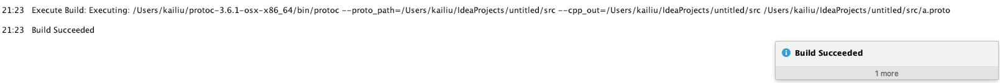

# ProtoGen

This is a plugin to add a build button to proto file in intellij.

Click the colorful "B" to show the build proto dialog:

In the following build proto dialog, we can specific:

1) include path, the path to find proto imports
2) language
3) output directory, the path to generate the proto file
4) the proto compiler path

Each parameter is memorized so the next time user execute build proto, they don't need to input the 
parameter again. 

After clicking the OK button, either build success or build error message will show in the intellij 
notification.

